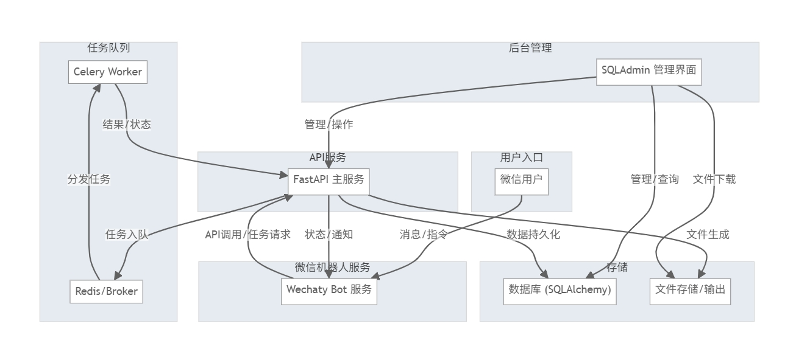

# WeDocX v0.2 系统架构图

## 架构说明
- **微信用户** 通过 **Wechaty Bot 服务** 发送消息/指令，触发业务流程。
- **Wechaty Bot** 调用 **FastAPI 主服务** 的 API，发起任务处理。
- **FastAPI 主服务** 负责业务逻辑、任务入队、数据持久化、文件生成等。
- **Celery Worker** 通过 **Redis/Broker** 异步处理任务，提升系统健壮性和扩展性。
- **SQLAdmin 管理界面** 提供任务、用户、日志等后台管理功能，支持与数据库和主服务交互。
- **数据库/文件存储** 负责数据和文件的持久化，支持后台管理和用户下载。

- **系统架构图** 

  ```mermaid
  flowchart TD
      subgraph "用户入口"
          A["微信用户"]
      end
      subgraph "微信机器人服务"
          B["Wechaty Bot 服务"]
      end
      subgraph "API服务"
          C["FastAPI 主服务"]
      end
      subgraph "后台管理"
          D["SQLAdmin 管理界面"]
      end
      subgraph "任务队列"
          E["Celery Worker"]
          F["Redis/Broker"]
      end
      subgraph "存储"
          G["数据库 (SQLAlchemy)"]
          H["文件存储/输出"]
      end
      
      A-->|"消息/指令"|B
      B-->|"API调用/任务请求"|C
      C-->|"任务入队"|F
      F-->|"分发任务"|E
      E-->|"结果/状态"|C
      C-->|"状态/通知"|B
      D-->|"管理/查询"|G
      D-->|"管理/操作"|C
      C-->|"数据持久化"|G
      C-->|"文件生成"|H
      D-->|"文件下载"|H
  ```


## 主要模块设计要点

### 1. 微信机器人服务（Wechaty Bot）
- 负责监听微信用户消息、指令，解析URL、指令等内容。
- 与 FastAPI 主服务通过 HTTP API 通信，转发用户请求。
- 支持任务状态主动推送、指令系统（/help、/status <任务ID> 等）。
- 具备异常处理与日志记录能力。

### 2. API服务（FastAPI 主服务）
- 提供 RESTful API，供微信机器人、后台管理等调用。
- 负责业务逻辑处理、任务入队、状态查询、文件生成等。
- 实现统一的异常处理和日志系统。
- 支持环境隔离（开发/生产），配置通过 .env/环境变量管理。

### 3. 任务队列（Celery + Redis）
- 负责异步处理耗时任务（如PDF生成、邮件发送等）。
- 支持任务自动重试、失败告警。
- 与主服务、存储模块解耦，提升系统健壮性和可扩展性。

### 4. 后台管理界面（SQLAdmin）
- 提供任务、用户、日志等数据的可视化管理。
- 支持筛选、搜索、详情、重试等操作。
- 可扩展权限控制、认证体系，与主服务统一认证。
- 支持自定义视图、批量操作、数据导出等高级功能。

### 5. 存储模块（数据库/文件存储）
- 采用 SQLAlchemy 管理业务数据（任务、用户、日志等）。
- 文件存储用于保存生成的PDF、导出文件等。
- 支持后台管理和用户下载。

### 6. 其他设计要点
- 各模块间通过 API/消息队列解耦，便于独立扩展和维护。
- 推荐使用 Docker 容器化部署，便于环境一致性和运维。
- 单元测试、集成测试覆盖关键业务流程，保障系统质量。

## 详细模块拆解

### 1. 微信机器人服务（Wechaty Bot）
- 消息监听与分发
  - 支持文本、图片、文件等多类型消息监听
  - 群聊与私聊消息区分处理
- 指令解析与处理
  - 支持 /help、/status <任务ID>、/start 等基础指令
  - 正则提取URL、任务ID等关键信息
- API 通信
  - 调用 FastAPI 主服务的任务处理、状态查询等接口
  - 处理 API 异常与重试机制
- 用户反馈与通知
  - 主动推送任务状态、异常、结果等消息给用户
  - 支持多轮对话上下文管理（可选）
- 日志与异常处理
  - 记录消息、指令、API调用、异常等日志
  - 支持日志分级与持久化
- 单元测试
  - 消息解析、指令处理、API调用等关键逻辑的测试

### 2. API服务（FastAPI 主服务）
- RESTful API 设计
  - /api/v1/process-url、/api/v1/task-status、/api/v1/retry-task 等接口
  - 输入输出参数校验与统一响应格式
- 业务逻辑处理
  - URL 解析、任务创建、状态管理、文件生成等
  - 与 Celery 任务队列集成
- 统一异常处理
  - 全局异常捕获与统一 JSON 错误响应
- 日志系统
  - 接入 loguru，日志文件分级、按日期切分
- 配置与环境隔离
  - 支持 .env 文件和环境变量，区分开发/生产环境
- 单元测试
  - API接口、业务逻辑、异常处理等测试

### 3. 任务队列（Celery + Redis）
- 任务定义与分发
  - create_pdf_task、send_email_task 等异步任务
  - 任务参数校验与序列化
- 自动重试与失败告警
  - 任务失败自动重试、最大重试次数、失败通知
- 任务状态管理
  - 任务进度、结果、异常等状态持久化
- 单元测试
  - 任务分发、重试、状态管理等测试

### 4. 后台管理界面（SQLAdmin）
- 任务数据建模
  - Task、User、Log 等 SQLAlchemy 模型设计
- 管理界面集成
  - SQLAdmin 集成到 FastAPI 应用，配置路由、认证
- 任务视图与操作
  - 任务列表、筛选、搜索、详情、重试、导出等
- 权限与认证
  - 基础认证体系、角色权限控制（可选）
- 日志与用户管理
  - 日志查询、用户管理、操作记录等
- 单元测试
  - 管理界面、模型、权限等测试

### 5. 存储模块（数据库/文件存储）
- 数据库设计
  - 任务、用户、日志等表结构设计与迁移
- 文件存储
  - PDF、导出文件等的存储、命名、清理策略
- 数据备份与恢复（可选）
- 单元测试
  - 数据库操作、文件存储等测试

### 6. 集成与部署
- Docker 容器化
  - FastAPI、Celery、Redis、Wechaty Bot、SQLAdmin 的容器编排
- 集成测试
  - 微信消息到任务完成的端到端流程测试
- 文档与运维
  - 环境变量、启动方式、部署流程、常见问题文档 